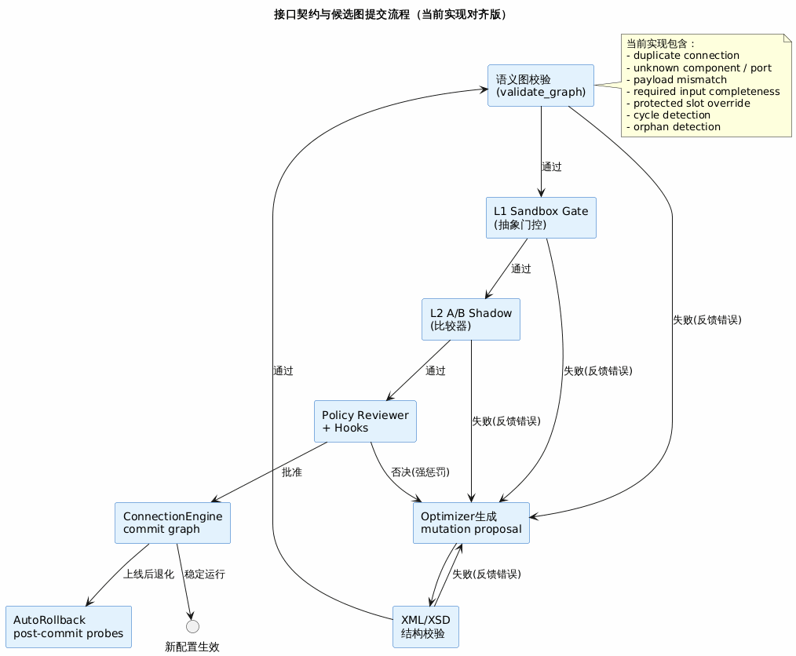
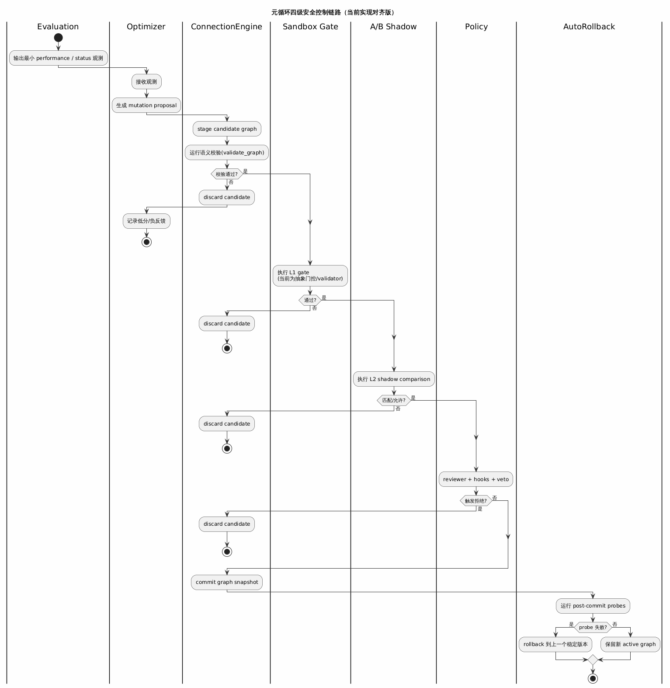

# 引言

## 研究背景与意义

随着大语言模型（Large Language Models, LLMs）能力的迅速提升，基于 LLM
的智能体（Agent）系统已成为人工智能应用落地的核心形态。从简单的单轮对话到复杂的多步骤任务调度、工具调用与多智能体协作，Agent
系统的结构正在变得越来越复杂。然而，当前大多数 Agent
框架仍采用"固定配置"的设计范式：开发者根据经验手工编排提示词（Prompt）、工具链、记忆模块与控制流，一旦部署完成，其结构在运行期间基本保持不变。这种范式在面对动态变化的任务分布、性能瓶颈或资源约束时，往往显得缺乏弹性。

近年来，学术界开始关注"元层面"的优化------即不再仅仅优化模型权重，而是优化包裹在模型外部的运行框架（Harness）。斯坦福与
MIT 联合提出的 **Meta-Harness**
框架表明：在固定底层模型的情况下，仅通过优化 harness
代码，就可能在同一基准上产生高达 6
倍的性能差距。与此同时，英属哥伦比亚大学提出的 **ADAS（Automated Design
of Agentic Systems）** 则展示了利用元智能体自动编写和迭代优化 Agent
代码的可行性。这些研究共同指向一个趋势：**Agent
系统的设计本身应当成为可自动优化的对象**。

基于上述背景，本手册提出一套面向工程落地的
**元Harness智能体自我重长框架**。该框架借鉴数值偏微分方程（PDE）求解器中的"迭代收敛"思想，将
Agent
系统抽象为由九大核心基础组件加一个元层优化器（Optimizer）构成的可配置图结构，并通过性能瓶颈驱动的自我重长机制动态调整组件连接参数乃至生成新组件，最终实现
Agent 从"固定配置"到"自我衍生"的跃迁。与现有研究相比，本方案特别强调
**接口标准化**、**安全可控** 与
**工程可落地性**，试图为通用智能体的设计提供一套兼具灵活性与稳定性的新范式。

## 国内外研究现状

### Harness 工程的自动化优化

Meta-Harness (Lee et al. 2026) 是 harness 工程领域的里程碑工作。它将
harness
定义为一个包裹固定语言模型的有状态程序，负责决定每一步给模型看什么上下文、如何更新状态、何时检索以及如何组织提示。Meta-Harness
通过一个外循环系统搜索最优 harness
代码，其核心创新在于：让编程智能体（proposer）通过文件系统访问所有历史候选的源码、评分和原始执行轨迹，从而进行基于证据的失败诊断与针对性修复。实验表明，在在线文本分类任务上，Meta-Harness
将平均准确率从 ACE 的 40.9% 提升到 48.6%，同时上下文 Token 消耗降低
75%。

ADAS (Hu et al. 2025)
则从另一个角度切入：它将代理系统的设计转化为代码空间中的搜索问题。通过一个元智能体（Meta
Agent）迭代地编写新代理代码并在验证集上评估，ADAS 在 DROP 阅读理解、MGSM
数学推理和 ARC 抽象推理等任务上均超越了手工设计的基线。这些研究表明，
richer access to prior experience（更丰富的历史经验访问）是实现自动化
harness 工程的关键。

### 自我改进型智能体与安全挑战

让 Agent 具备修改自身代码的能力是一把双刃剑。Gödel Agent (Yin et al.
2024) 提出了递归自我改进的自参照框架，允许 Agent
读取自身代码、生成修改并即时生效。Darwin Gödel Machine（DGM）(Zhang et
al. 2025)
更进一步，将自我改进与开放式演化结合，使智能体能够自动设计奖励函数并持续优化自身。然而，这类系统也带来了显著的安全风险：自我修改可能在提升目标指标的同时引入漏洞、与人类意图不一致的行为，或导致系统内部逻辑变得越来越难以理解
(Zhang et al. 2026)。

为应对这些风险，当前主流的自我改进系统普遍采用以下安全措施：

- **沙箱隔离**：所有执行与自我修改在隔离环境中进行；

- **时间/资源限制**：防止无边界行为与资源耗尽；

- **范围约束**：限定自我修改的影响范围；

- **自动回滚**：当修改导致异常时恢复至上一次稳定版本。

### 组件化系统与接口契约

在软件工程领域，组件化（Component-based）设计是构建复杂系统的经典方法。BIP
框架 (Basu et al. 2011) 强调通过严格的接口契约（Interface
Contract）和行为模型来确保组件组合的正确性。DynaComm (Ling 2007)
则扩展了组件模型以支持动态重构。对于本手册所设计的元Harness系统而言，**接口标准化**
是支撑动态组件生成与热加载的基石：只有在组件接口被显式定义并受 Schema
校验的前提下，Runtime 才能在运行时安全地解析组件间的连接关系。

## 研究目标与主要贡献

本手册的研究目标是：设计并阐述一套
**可工程落地的元Harness智能体自我重长框架**，使其能够在保持系统稳定与安全的前提下，根据任务性能瓶颈动态调整自身结构。具体贡献包括：

1.  **跨学科设计理念**：将数值 PDE
    的"迭代收敛"与"后验误差"思想迁移到智能体系统设计，提出基于性能瓶颈触发的自我重长机制。

2.  **接口契约驱动的组件体系**：在 XML 配置中引入显式的 `<Interface>`
    标签，建立组件接口标准与静态兼容性校验规则，为动态重构提供形式化基础。

3.  **四级安全控制机制**：设计了"沙箱验证 → A/B 影子测试 → Policy
    宪法否决 → 自动回滚"的完整安全链路，确保自我修改的可控性。

4.  **Pareto
    多目标优化与统计收敛**：将单一标量误差扩展为多维性能向量，采用
    Pareto 超体积与统计检验作为收敛判据，提升评估的鲁棒性。

## 论文结构

本手册共分为六章，结构安排如下：

**第一章** 为引言，介绍研究背景、国内外现状与主要贡献。

**第二章** 介绍相关研究与基础概念，包括
Meta-Harness、ADAS、自我改进型智能体、Pareto
优化与组件化接口契约等内容。

**第三章** 阐述元Harness框架的总体设计，包括九大核心基础组件、结构化 XML
配置方案以及接口契约与兼容性校验机制。

**第四章** 详细介绍自我重长机制与安全控制，涵盖触发条件、Pareto
评估、受约束的组件生成与优化、四级安全机制以及收敛判断。

**第五章**
讨论工程化实现与关键技术，包括基础框架开发路线、组件模板库、Optimizer
中的搜索与优化策略（进化搜索为主、强化学习为可选增强）、沙箱与 A/B
测试基础设施等。

**第六章** 对全文进行总结，并展望未来研究方向。

# 相关研究与基础概念

本章系统梳理与元Harness框架密切相关的研究领域与核心概念，包括 Harness
工程的自动化优化、自动代理设计系统、自我改进型智能体的安全挑战、多目标
Pareto
优化以及组件化系统的接口契约理论。这些内容为后续章节的框架设计与机制阐述奠定理论基础。

## Harness 工程与 LLM 系统优化

### Harness 的定义与重要性

在大语言模型系统中，**Harness**
指的是包裹固定模型的"外壳代码"------它决定每一步给模型看什么上下文、如何更新内部状态、何时调用检索工具以及如何组织提示词（Prompt）。Meta-Harness
的研究者指出：**同一个底模，仅改变 harness，在同一 benchmark
上就可能拉出 6 倍的性能差距** (Lee et al.
2026)。这表明，当模型能力逐渐接近时，决定系统上限的往往不再是参数规模，而是模型外层那套能否被持续优化的"工作方式"。

与传统的 Prompt 工程不同，Harness 工程关注的是 **完整程序**
的优化。这包括：

- 上下文管理（Context Management）与记忆更新策略；

- 检索路由（Retrieval Routing）与重排逻辑；

- 工具定义（Tool Definitions）与编排（Orchestration）；

- 完成检查（Completion Checking）与错误恢复逻辑。

### Meta-Harness 的关键方法论

Meta-Harness 的核心创新在于其"外循环 +
文件系统历史经验"的设计。与传统方法将反馈压缩成摘要、标量分数或短模板不同，Meta-Harness
将所有历史候选的源码、评分和原始执行轨迹写入文件系统，让 coding
agent（proposer）主动通过 `grep`、`cat` 等工具检索所需信息 (Lee et al.
2026)。在高难设定下，proposer 每轮中位数读取 **82 个文件**，其中约 41%
是旧 harness 代码，40% 是执行轨迹。这说明 harness search
的关键不在于更精致的摘要，而在于 **保留原始执行轨迹中的诊断细节**。

Meta-Harness 的另一个重要方法论是 **Pareto
前沿筛选**。在同时考虑准确率与上下文成本时，Meta-Harness
不追求单一最优解，而是维护一组在多个目标上均无法被其他候选支配的 harness
集合，供决策者根据场景需求选择。

## 自动代理设计系统（ADAS）

### ADAS 的研究范式

ADAS（Automated Design of Agentic Systems）(Hu et al. 2025)
是英属哥伦比亚大学与 Vector
研究所提出的新兴研究方向。其核心思想是：利用一个 **元智能体（Meta
Agent）** 自动编写和修改代码，从而发现和设计更优秀的智能体系统。ADAS
将代理设计转化为一个搜索问题，搜索空间不再是超参数，而是 **代码**
本身。由于编程语言的图灵完备性，这种方法理论上可以学习任何代理系统，包括新的提示、工具使用方式和控制流。

ADAS 的核心算法 **Meta Agent Search** 的工作流程如下：

1.  元智能体基于当前最优代理代码提出修改；

2.  生成的新代理在验证集上执行并评估性能；

3.  将评估结果反馈给元智能体，用于指导下一轮搜索；

4.  迭代直至发现满足性能要求的代理设计。

实验结果表明，ADAS
发现的代理在编码、数学和科学等多个领域均显著优于最先进的手工设计代理，并且具有良好的跨领域和跨模型迁移能力。

### 从 ADAS 到元Harness的映射

本手册提出的元Harness框架可以看作 ADAS 思想在 **结构化配置空间**
中的工程化实现。与 ADAS 直接在无约束的代码空间中搜索不同，元Harness 通过
XML
配置和组件模板库将搜索空间约束在一个更易验证、更安全的范围内，从而降低工程落地的复杂度。

## 自我改进型智能体与安全挑战

### Gödel Agent 与递归自我改进

Gödel Agent (Yin et al. 2024)
是一个自参照的自我改进框架。其名字来源于哥德尔不完备定理中的"自指"思想：系统能够读取自身代码，将其作为输入进行推理，并在认为有益时生成新代码以动态修改自身。Gödel
Agent 的核心能力包括：

- **代码自省**：读取并理解构成自身操作的变量、函数与类；

- **动态代码修改**：生成新代码并写入运行时内存，即时生效；

- **错误恢复**：当修改导致异常时，回滚并将错误信息用于改进未来决策。

### Darwin Gödel Machine（DGM）

Darwin Gödel Machine（DGM）(Zhang et al. 2025) 将 Gödel Agent
的自改进能力与达尔文式的开放式演化结合。DGM
不仅优化任务策略，还能优化自身的奖励函数与元认知模块。DGM-Hyperagents（DGM-H）更进一步，允许智能体修改自身的改进机制（即"元认知自我修改"）。

DGM
的研究者进行了关键的消融实验：如果去掉自我改进能力，仅保留固定的元智能体，测试准确率会大幅下降（如在论文评审任务上降至
0%）。这证明了
**自我改进能力本身对系统性能至关重要**。但同时，研究者也专门用一节讨论安全风险：随着系统越来越能开放式地修改自己，其演化速度可能超过人类审计和理解速度。

### 安全防护的共识

综合现有研究，自我改进系统的安全防护已形成以下共识：

- **沙箱隔离**：所有执行与修改在 Docker 或虚拟机等隔离环境中进行；

- **时间/资源限制**：为每次沙箱执行设定严格的 CPU
  时间、内存和网络策略上限；

- **范围约束**：限定自我修改仅限于特定领域（如修改自身 Python
  代码库以提升某基准性能），禁止触及操作系统或外部网络；

- **人工监督与可追溯性**：记录完整的修改谱系（Lineage），便于后续审查；

- **自动回滚**：在新版本导致性能退化或系统异常时，自动恢复至上一稳定版本。

## 多目标优化与 Pareto 收敛

### 多目标优化问题

在 Agent 系统设计中，通常需要同时优化多个相互冲突的目标，例如：

- 准确率（Accuracy）

- 响应时间 / 吞吐量（Latency / Throughput）

- 资源消耗（GPU 显存、CPU 占用）

- 上下文成本（Context Token Cost）

这些目标往往无法同时达到最优。例如，提高准确率可能需要引入更复杂的检索或验证流程，从而增加响应时间和
Token
消耗。因此，单一标量加权求和的方法容易陷入局部最优，且权重的选择具有很强的主观性。

### Pareto 支配与 Pareto 前沿

在多目标优化中，**Pareto 支配**（Pareto
Dominance）是判断解之间优劣的标准。对于一个解 $x$ 和另一个解 $y$：

- 如果在所有目标上 $x$ 都不劣于 $y$，且至少在一个目标上 $x$ 严格优于
  $y$，则称 $x$ **支配** $y$；

- 如果一个解不被任何其他解支配，则称其为 **Pareto 最优解**；

- 所有 Pareto 最优解构成的集合称为 **Pareto 前沿**（Pareto Front）。

### 超体积（Hypervolume）

**Hypervolume**（也称为 S-metric）是衡量 Pareto
前沿质量的重要指标。它表示 Pareto
前沿所覆盖的目标空间体积。在迭代优化过程中，若新一代的 Pareto
前沿相对于参考点的 **Hypervolume Improvement**（超体积增量）趋于
0，则说明优化已经收敛。相比于简单的加权求和，Hypervolume
能够同时反映解集的收敛性与多样性，因此被广泛用于多目标强化学习与神经架构搜索中。

## 组件化系统与接口契约

### 组件化设计的优势

组件化（Component-based）设计通过将复杂系统分解为功能独立、接口清晰的模块，降低了开发复杂度并提升了系统的可维护性与可扩展性。在动态自适应系统中，组件化设计的另一大优势是支持
**运行时的结构重构**（Dynamic
Reconfiguration）：在不中断系统服务的前提下，增删或替换组件实例及其连接关系。

### 接口契约与动态重构

然而，动态重构的前提是 **接口契约**（Interface Contract）的严格定义。BIP
框架 (Basu et al. 2011)
指出：只有在组件的端口类型、交互协议与行为约束被显式声明并验证后，才能安全地执行结构重组。DynaComm
(Ling 2007) 进一步提出，动态软件架构的重构应当被建模为图转换（Graph
Transformation），且重构规则需与实现代码分离。

对于本手册的元 Harness 框架而言，接口契约体现在 XML 配置中的
`<Interface>` 标签：每个组件必须声明其输入端口（`<Input>`）、
输出端口（`<Output>`）和事件类型（`<Event>`）。Runtime 在执行热加载前，
必须对 `<Connection>`
进行静态兼容性检查，包括类型匹配、事件声明和输入完整性验证。

## 本章小结

本章从 Harness
工程、自动代理设计、自我改进安全、多目标优化和组件化系统五个维度，梳理了元Harness框架的理论基础与相关研究。核心结论如下：

1.  Harness
    工程的优化对象是完整程序，保留原始执行轨迹是实现高效诊断的关键；

2.  自我改进型智能体必须具备沙箱、回滚与范围约束等安全机制；

3.  多目标 Pareto 优化与 Hypervolume 收敛判据比单一标量误差更适合评估
    Agent 系统；

4.  接口契约是组件化系统支持动态重构的前提条件。

在后续章节中，我们将把这些理论与工程原则融入到元Harness框架的具体设计中。

# 元Harness框架总体设计

本章阐述元Harness智能体自我重长框架的总体架构设计。首先介绍核心设计理念------借鉴数值
PDE
求解器的"迭代收敛"思想；随后详细说明九大核心基础组件与元层优化器的定义及组合规则；接着给出结构化
XML
配置方案的具体规范；最后重点论述接口契约与兼容性校验机制，这是支撑系统安全动态重构的基石。

## 设计理念

### 从固定配置到自我衍生

传统 Agent
框架普遍采用"设计时固定、运行时静态"的配置范式。开发者手工编写提示词模板、工具列表和调用流程，然后将这些配置打包部署。这种范式在任务分布稳定、需求明确的场景下表现良好，但当面对以下挑战时往往力不从心：

- 任务类型或输入分布发生漂移（Distribution Shift）；

- 出现新的工具或数据源，需要动态调整调用策略；

- 系统在特定子任务上出现性能瓶颈，需要引入专门的校验或重试逻辑；

- 部署环境资源受限，需要在准确率与延迟/成本之间做动态权衡。

元Harness框架的设计目标正是为了解决上述问题：**让 Agent 系统能够像数值
PDE
求解器一样，通过迭代收敛的方式自我调整结构，最终达到满足任务需求的最优配置**。

### 迭代收敛与后验误差

在数值 PDE
求解中，求解器从一个初始猜测出发，通过反复计算残差（Residual）并更新解，直至残差小于某个预设阈值或连续迭代的解变化量极小。我们将这一思想迁移到智能体设计中：

- **初始猜测**：由开发者提供的基础 XML 配置（初始组件组合）；

- **残差**：对应于 Agent
  在当前任务上的"后验误差"（即多维性能向量与目标之间的差距）；

- **更新操作**：Optimizer 根据后验误差生成新的组件组合或调整连接参数；

- **收敛准则**：当性能指标满足预设阈值或连续多轮改进不显著时，停止自我重长。

这种设计既保留了组件化的灵活性，又通过数学化的收敛准则确保了系统行为的可解释性与稳定性。

> **类比局限性说明**：上述映射应理解为**直觉层面的类比**，而非严格的形式等价。数值
> PDE 求解的收敛性有 Banach 不动点定理等严格数学保证（要求压缩映射），但
> Agent 系统中的"残差"（性能向量）与"更新操作"（Optimizer
> 决策）构成的是一个**非凸、非连续、部分可观测**的搜索过程。Hypervolume
> 的单调递增不能保证收敛到全局最优，甚至不能保证找到有意义的局部最优。此外，LLM
> 输出的非确定性使得"残差"本身具有高方差，收敛准则中的阈值 $\varepsilon$
> 需要结合实际方差进行自适应调整（详见第四章收敛判断部分）。因此，PDE
> 类比的价值在于提供了"迭代改进直至停止"的工程框架，而非数学上的收敛保证。

## 九大核心基础组件 + 元层优化器

元Harness框架将 Agent
系统抽象为**九大核心基础组件**加一个**元层优化器（Optimizer）**。每个核心组件承担明确的功能边界，且通过声明式接口进行交互；Optimizer
位于核心组件之上，负责驱动自我重长循环。表
[3.1](#tab:components)
给出了各组件的职责说明。为避免术语混用，表
[3.3](#tab:terminology) 同时给出了各组件的标准中英文对照。

  **组件名**      **英文**       **职责说明**
  --------------- -------------- ---------------------------------------------------------------------------------------------------------------------------------------------------------------------------------------------------------------------------------------
  Runtime         运行时调度器   接收并解析 LLM 输出的 JSON 指令，协调组件执行流程；**负责结果后处理**（截断、摘要、格式化、重封装）；处理指令转换与结果反馈；负责配置热加载、沙箱调度与回滚执行。
  Gateway         网关接口       负责外部指令接收与内部动作转换，管理 Agent 协作通信；**从 Identity 获取并挂载调用凭证，对返回结果中的敏感凭证信息进行剥离**。
  Memory          记忆存储       **上下文管理**（决定 LLM 每轮能\"看到\"什么：滑动窗口、自动摘要、相关性过滤）；记录执行数据、历史经验及组件配置信息；**必须支持原始执行轨迹的全量持久化**。
  Policy          策略规则       定义组件交互权限、执行约束及失败恢复策略；在自我重长场景中作为"宪法层"。
  Identity        身份管理       处理权限校验、凭证安全及 Agent 身份标识。
  Evaluation      性能评估       **双重职能**：一方面基于任务目标计算多维性能向量与 Pareto 前沿（性能优化向）；另一方面承担运行期质量控制（质量控制向），包括死循环检测、重复调用识别、无效策略终止、硬限制 enforcement（最大调用次数、最大 Token 数、最大运行时长）。
  Observability   可观测性       实时监控组件执行状态、资源消耗、任务进度及组件间数据流快照；**支持全链路 Trace、执行回放（Replay）与崩溃恢复**。
  Sandbox         代码沙箱       **执行 LLM 生成的代码**，提供隔离运行环境，与 Policy 联动做权限隔离；可扩展为 Browser 等外部工具的执行容器。
  Browser         浏览器工具     **网页访问与信息检索**，受 Policy 的速率/范围限制，是 Harness 的原生\"手脚\"之一。

  : 元Harness九大核心组件

需要特别说明的是，**Sandbox** 与 **Browser** 在业界对 Harness
的标准定义中属于一等基础组件（如 Anthropic、OpenAI 的 Agent 架构均将
Code Interpreter 与 Browser Tool 视为 Harness
核心），而非外部第三方工具。将它们纳入核心组件体系，能够更准确地对齐
Harness 的工业标准定义。

  **组件名**   **英文**     **职责说明**
  ------------ ------------ --------------------------------------------------------------------------------------------------------------------------------------------------------------------------------------------------------------
  Optimizer    智能优化器   位于九大核心组件之上，负责驱动自我重长循环；集成搜索与优化模块，负责组件调参、动态组合、行为策略学习及受约束的新组件生成。Optimizer 自身不参与任务执行，而是通过修改核心组件的配置与连接来间接影响系统行为。

  : 元层组件

Optimizer 的特殊性在于：它是唯一可以修改其他组件配置的组件，但自身受
Policy
宪法层约束，且其修改必须经过四级安全链路验证后才能生效。这种"元层分离"的设计确保了任务执行路径与结构优化路径的解耦。

进一步地，**Policy**、**Identity** 以及 **Evaluation**
中承担运行期质量控制的部分，应被视为**受保护组件**。这些组件负责约束边界、凭证安全与失效终止，不应被
Optimizer
直接绕过或隐式削弱。凡涉及上述受保护组件规则、接口或执行位置的修改，工程上都应设置**人工复核闸门**，以防通过重连数据流、降级校验顺序等间接方式削弱治理能力。

此外，Evaluation
的\"运行期质量控制\"职能（死循环判定、无效策略终止）在工程实现中可通过内部子模块
**LoopGuard** 来承载，但 LoopGuard 在概念上仍隶属于 Evaluation 层。

  **英文原文**       **中文翻译**
  ------------------ -------------------------
  Runtime            执行环境 / 运行时调度器
  Memory             记忆 / 上下文存储
  Gateway            网关 / 路由层
  Browser Tool       浏览器工具
  Identity           身份管理
  Code Interpreter   代码解释器 / 代码沙箱
  Observability      可观测性
  Policy             策略
  Evaluations        评估 / 质量控制

  : Harness 核心组件标准中英文对照

表 [3.3](#tab:terminology) 中的翻译与当前工业界（尤其是
Anthropic、OpenAI 等主流 Agent
架构文档）的通用叫法保持一致。本书后续章节将统一使用左侧的中文翻译进行论述。

### 组件组合规则

基础组件通过"功能场景化组合"实现具体能力。以下是几种典型的组合模式：

- **指令转动作**：Runtime + Gateway。Gateway
  将外部请求转换为内部统一命令格式，Runtime 负责调度后续执行。

- **权限检查**：Policy + Identity。任何涉及敏感操作或跨 Agent
  通信的请求都需经过 Policy 规则校验与 Identity 身份确认。

- **防止死循环**：Policy + Evaluation。Policy
  设定最大迭代次数与超时规则，Evaluation（通过其内部子模块
  LoopGuard）在每次循环后评估是否达到退出条件，判定无效策略并触发强制终止。

- **执行记录**：Memory + Observability。Observability
  采集组件级指标与数据流快照，Memory 负责持久化存储原始执行轨迹。

- **Agent 协作**：Runtime + Gateway + Memory。Runtime 协调多个子 Agent
  的执行顺序，Gateway 处理 Agent 间消息路由，Memory 维护共享上下文。

- **管理凭证安全**：Identity + Gateway。Gateway 在转发工具调用请求时从
  Identity 获取凭证并附在请求上，大模型只与 Gateway 交互，永远碰不到
  Identity 中的密钥。

- **安全自改进**：Policy（宪法层）+ Runtime（沙箱/回滚）+
  Optimizer。Policy 对 Optimizer 生成的新配置进行安全审查，Runtime
  负责在隔离环境中验证并执行回滚。

## 结构化配置方案

元Harness采用 XML 作为结构化配置语言。XML
的显式标签结构天然适合表达组件声明、连接关系与层次化的元循环逻辑，同时也便于通过
XSLT 等工具转换为 PlantUML 图进行可视化。

### 配置文件的核心标签

XML 配置包含四类核心标签：`<Component>`、`<Connection>`、`<MetaCycle>`
和 `<Sandbox>`。

#### 组件定义：`<Component>`

`<Component>` 标签用于定义组件实例。每个组件必须具有全局唯一的
`id`、明确的 `type` 以及可选的 `params`。在 v2 版本中，**每个
`<Component>` 必须包含 `<Interface>`
子标签**，显式声明其输入、输出和事件类型。

``` {#lst:component caption="带接口契约的组件定义示例" label="lst:component"}
<Component id="Runtime_1" type="Runtime" params="max_retries=3">
  <Interface>
    <Input name="command" type="Command"/>
    <Output name="action" type="Action"/>
    <Event name="on_config_reload"/>
  </Interface>
</Component>

<Component id="Gateway_1" type="Gateway" params="protocol=http">
  <Interface>
    <Input name="raw_request" type="HTTPRequest"/>
    <Output name="command" type="Command"/>
  </Interface>
</Component>
```

#### 连接关系：`<Connection>`

`<Connection>` 标签定义组件之间的有向连接关系，包含
`from`、`to`、`trigger` 三个属性。子标签 `<Property>`
用于描述连接的交互规则与数据映射。

``` {#lst:connection caption="连接关系定义示例" label="lst:connection"}
<Connection from="Runtime_1" to="Gateway_1" trigger="指令转换">
  <Property key="action" value="parse_command"/>
  <Property key="input_mapping" value="command->command"/>
</Connection>
```

#### 元循环：`<MetaCycle>`

`<MetaCycle>` 标签描述自我重长的闭环调优流程。与传统设计不同的是，v2
版本的 `<MetaCycle>` 不直接跳到热加载，而是嵌入完整的四级安全链路。

``` {#lst:metacycle caption="带安全链路的 MetaCycle 示例" label="lst:metacycle"}
<MetaCycle>
  <Step component="Evaluation" output="post_error_pareto"/>
  <Step component="Optimizer" input="post_error_pareto" output="candidate_config"/>
  <Step component="Runtime" input="candidate_config" action="sandbox_validate"/>
  <Step component="Evaluation" input="sandbox_results" action="shadow_ab_test"/>
  <Step component="Policy" input="candidate_config" action="constitutional_veto"/>
  <Step component="Runtime" input="approved_config" action="hot_reload_or_rollback"/>
</MetaCycle>
```

#### 沙箱策略：`<Sandbox>`

`<Sandbox>` 标签用于定义沙箱执行的资源与网络策略，是安全控制的基础设施。

``` {#lst:sandbox caption="沙箱策略定义示例" label="lst:sandbox"}
<Sandbox timeout_sec="60" max_memory_mb="512" network_policy="isolated"/>
```

## 接口契约与兼容性校验

### 接口标准化的必要性

接口标准化是元Harness框架从"概念"走向"工程落地"的关键一步。如果没有显式的接口契约，Runtime
将无法判断 Optimizer
生成的新组件是否能与现有系统正确连接。具体而言，接口标准化的必要性体现在以下三个方面：

1.  **支持静态兼容性校验**：在沙箱验证之前，通过 Schema
    检查过滤掉类型不匹配、事件未声明或输入缺失等低级错误，大幅降低试错成本。

2.  **约束 Optimizer
    的动作空间**：如果新组件的接口是随意生成的，强化学习智能体很容易在大量无效的"孤儿组件"上浪费探索预算。接口标准相当于对动作空间进行了一次有效的先验剪枝。

3.  **确保动态重构的安全性**：所有组件框架（如
    BIP、SOA）的理论与实践经验均表明，动态重构必须以接口稳定为基石。接口契约是组件之间"互不侵犯"的法律边界。

### 兼容性校验规则

当 Optimizer 输出新的候选 XML 配置后，Runtime
的兼容性校验器会在沙箱验证之前执行以下静态检查：

1.  **类型匹配**：`<Connection>` 的 `from` 端所声明的 `Output`
    类型必须与 `to` 端的 `Input` 类型严格匹配或可协变（Covariant）。

2.  **事件声明**：`trigger` 属性所引用的事件名称必须在 `from` 端组件的
    `<Interface>` 中显式声明。

3.  **输入完整性**：每个组件的所有 `required="true"` 的 `<Input>`
    必须被至少一条 `<Connection>` 满足。

4.  **ID 唯一性**：所有 `<Component>` 的 `id`
    属性在整个配置文件中必须全局唯一。

5.  **无环约束（可选）**：根据应用场景，可进一步要求组件连接图在数据流层面无环，以防止逻辑死锁。

只有通过全部校验的候选配置，才能进入后续的沙箱验证与 A/B
测试阶段。如果校验失败，系统会将错误信息反馈给
Optimizer，作为负向奖励信号，促使 Optimizer 在下一次生成时规避同类错误。

### 契约驱动的动作空间剪枝

接口契约的价值不仅在于"能否连通"，还在于将 Optimizer
的搜索限制在**可执行、可验证、可回滚**的候选集合内。对于连接重布线、组件替换和模板实例化这类高频动作，契约提供了一个先于沙箱执行的合法性边界：凡是不满足输入输出类型、事件声明或必需依赖条件的候选变更，都应在生成后立即被静态过滤，而不进入后续验证链路。

从工程角度看，这相当于把"先尝试、后报错"的盲目探索改为"先校验、后试验"的受约束搜索。Optimizer
不必在大量明显无效的连接、孤立组件或缺失触发条件的拓扑上浪费预算，而是优先评估那些已经满足接口基本不变量的候选方案。这样既降低了沙箱与影子测试的负载，也让负向反馈更集中于真正有比较价值的结构差异，而非低级装配错误。

因此，接口契约应被视为动作生成阶段的一道前置筛网：它并不替代后续的安全验证，但能尽早剪除无效
rewiring 与非法 action，使搜索过程更接近工程上可接受的设计空间。

### 接口契约的工程实现

在实际工程中，接口契约可以通过 XML Schema
Definition（XSD）与自定义校验器相结合的方式实现。XSD
负责语法层面的约束（如标签结构、必填属性），而自定义校验器负责语义层面的约束（如类型匹配、事件声明、输入完整性）。图
[3.1](#fig:interface_contract)
展示了接口契约在配置热加载流程中的位置。

<figure id="fig:interface_contract" data-latex-placement="htbp">

<figcaption>接口契约与配置热加载流程</figcaption>
</figure>

### 热加载状态迁移协议

配置热加载在工程上不能理解为对 XML
文件的简单替换，因为组件内部往往持有上下文缓存、会话队列、统计计数器或中间执行状态。如果只完成结构切换而不处理状态连续性，新的组件图即使通过接口校验，也可能在恢复运行后出现上下文丢失、消息错序或行为突变。

因此，元Harness 应采用 **Suspend-Transform-Resume** 三阶段协议。第一阶段
**Suspend** 由 Runtime
暂停旧组件的对外副作用并缓存迁移窗口内的入站消息；第二阶段 **Transform**
根据新旧配置差异提取旧状态并执行转换；第三阶段 **Resume**
将转换后的状态注入新组件实例，再恢复消息投递与正常执行。整个过程应由
Runtime 以原子方式编排，以便在转换失败时直接回退到旧配置。

形式化地，若旧状态空间为 $S_{old}$，配置增量为 $\Delta P$，新状态空间为
$S_{new}$，则状态迁移可表示为映射
$$\tau: S_{old} \times \Delta P \to S_{new}$$ 其中 $\Delta P$
描述本轮热加载引入的参数、连接或组件结构变化。该映射强调：热加载不仅是配置变更，也是状态表示的受约束重解释。

据此，凡由 Optimizer 生成的配置变更，原则上都应携带对应的 Python
状态转换逻辑，用于把旧组件实例中的关键运行态映射到新实例。只有同时具备"配置差异"与"状态变换"两部分描述，热加载才能从静态重装升级为可控的在线迁移。

## 本章小结

本章详细介绍了元Harness框架的总体设计。首先阐述了借鉴 PDE
迭代收敛思想的设计理念，并说明了这一类比的适用边界；随后给出了**九大核心基础组件**加**元层优化器（Optimizer）**的定义与典型组合规则，明确对齐了
Harness
的工业标准定义，并补充了受保护组件与元层分离的人机治理边界；接着系统描述了基于
XML 的结构化配置方案，包括 `<Component>`、`<Connection>`、`<MetaCycle>`
和 `<Sandbox>`
四类核心标签；最后重点论述了接口契约的必要性、兼容性校验的五条规则、契约驱动的动作空间剪枝、配置热加载中的状态迁移协议及其工程实现方式。这些设计共同构成了元Harness系统安全、灵活、可扩展的运行时基础。

# 自我重长机制与安全控制

本章深入阐述元Harness框架的核心机制------**自我重长**（Self-Growth），并系统介绍围绕该机制构建的安全控制体系。首先说明性能瓶颈驱动的触发条件；随后提出基于
Pareto
的多目标后验误差评估方法；接着论述受约束的组件生成与优化策略；然后详细解析"沙箱验证
→ A/B 影子测试 → Policy 宪法否决 →
自动回滚"四级安全机制；最后给出收敛判断与复杂度控制准则。

## 性能瓶颈驱动的触发条件

元Harness遵循"极简主义"设计原则：**仅当 Agent
出现性能瓶颈时，才触发自我重长**。这一机制的目的是避免系统在无意义的情况下不断复杂化，从而保持结构的简洁性与可解释性。

### 多维性能向量的计算

Evaluation 模块在每个任务周期结束后计算一个多维性能向量：
$$\begin{equation}
\mathbf{P} = (P_{\text{acc}}, P_{\text{lat}}, P_{\text{res}}, P_{\text{ctx}})
\end{equation}$$ 其中：

- $P_{\text{acc}}$：准确率（Accuracy）。在文本任务中对应文本匹配度（如
  BERTScore、ROUGE-L 或任务特定的语义相似度）；在分类任务中直接采用
  Accuracy 或 F1 分数。

> **评估可行性说明**：$P_{\text{acc}}$
> 的计算假设存在可靠的评估基准（Ground
> Truth）或代理指标。在分类、信息提取等封闭式任务中，这通常是可行的；但在开放式生成任务（如自由文本对话、创意写作、科学研究）中，自动评估的可靠性显著下降。对于后者，建议采用以下策略：(1)
> 使用 LLM-as-Judge 作为代理评估器，并定期与人工评估结果对齐；(2)
> 将开放式任务拆解为可量化的子维度分别评估；(3)
> 在无法可靠量化时，暂停自我重长并请求人工反馈。

- $P_{\text{lat}}$：效率（Latency）。对应端到端响应时间或单位时间内的任务处理数（TPS）。

- $P_{\text{res}}$：资源消耗（Resource）。对应 GPU 显存峰值（MB）或 CPU
  占用率（%）。

- $P_{\text{ctx}}$：上下文成本（Context
  Cost）。对应处理单次任务所消耗的上下文 Token 总数，这是 Meta-Harness
  明确优化的独立成本维度。

### 瓶颈判断逻辑

瓶颈判断分为两个层次：

1.  **参数调整层**：当多维性能向量在连续 $N$ 轮内未出现显著改善（如
    Pareto 前沿无新点加入），Optimizer
    首先尝试在现有组件结构内调整参数（如修改 `max_retries`、`top_k`
    等）。

2.  **结构重长层**：若参数调整在连续 $N$
    轮后仍无法突破瓶颈，则判定当前结构已达性能天花板，**启动组件生成流程**，允许
    Optimizer 修改组件连接拓扑或生成新组件。

这种分层触发机制确保了系统优先利用现有结构的潜力，仅在必要时才进行成本更高的结构演化。

## Pareto 多目标后验误差评估

### 从加权求和到 Pareto 优化

传统的单一标量误差（如加权和）存在明显缺陷：权重的选择具有主观性，且容易引导优化器陷入某个目标的局部最优。为了更全面地评估
Agent 系统的性能，元Harness采用 **Pareto 多目标优化** 框架。

在每个评估周期，Evaluation 模块维护一个 **候选配置集合**
及其对应的性能向量集合。对于任意两个候选配置 $A$ 和 $B$：

- 若 $A$ 在所有目标上均不劣于 $B$，且至少在一个目标上严格优于 $B$，则称
  $A$ **支配** $B$，并将 $B$ 从候选集合中剔除。

- 最终保留下来的候选配置构成当前的 **Pareto 前沿**。

### 带约束的标量化策略

在某些需要快速决策的场景（如 RL 奖励计算）中，Pareto
集合本身无法直接作为标量奖励。此时可采用 **带约束的标量化** 策略。例如：

- **预算约束**：在上下文 Token 成本不超过预算 $C_{\max}$
  的前提下，最大化准确率 $P_{\text{acc}}$。

- **达标约束**：在准确率满足阈值 $A_{\min}$ 的前提下，最小化响应时间
  $P_{\text{lat}}$。

这种策略比无约束的加权和更符合工程实际需求。

### Hypervolume 作为收敛指标

为了量化 Pareto 前沿的演化进度，Evaluation 模块采用
**Hypervolume**（超体积）作为核心指标。给定一个参考点
$\mathbf{r}$（通常取各目标最差值的组合），Hypervolume 定义为 Pareto
前沿与参考点之间所围成的目标空间体积： $$\begin{equation}
HV(\mathcal{F}, \mathbf{r}) = \Lambda\left( \bigcup_{\mathbf{p} \in \mathcal{F}} \left\{ \mathbf{x} \mid \mathbf{r} \preceq \mathbf{x} \preceq \mathbf{p} \right\} \right)
\end{equation}$$ 其中 $\mathcal{F}$ 是 Pareto 前沿，$\Lambda$ 表示
Lebesgue 测度。Hypervolume
同时反映了前沿的收敛性（靠近理想点）与多样性（覆盖范围广），因此非常适合作为
RL 的奖励信号或收敛判据。

> **计算复杂度注意**：Hypervolume 的精确计算复杂度为 $O(n^{d-1})$（$n$
> 为候选配置数，$d$
> 为目标维度）。在本框架的四维性能向量（$d=4$）下，当候选配置数超过数百时，精确计算可能成为瓶颈。建议采用
> **Monte Carlo 近似**（Bader-Zitzler 采样法）或 **WFG
> 算法**进行高效估算，在保证足够精度的前提下将计算复杂度降至
> $O(n \cdot s)$（$s$ 为采样点数，通常取 $10^4 \sim 10^5$
> 即可满足需求）。

## 受约束的组件生成与优化

Optimizer
是元Harness框架中负责"自我重长"的智能核心。为了在保证收敛效率的同时控制风险，Optimizer
的动作空间被严格约束在五个层次内。

### 状态空间

Optimizer 的当前状态 $s_t$ 由以下要素构成： $$\begin{equation}
s_t = \{ G_t, \tau_t, \mathcal{T}_t, \mathcal{F}_t \}
\end{equation}$$ 其中：

- $G_t$：当前组件组合图（拓扑结构），可编码为邻接矩阵或图神经网络输入；

- $\tau_t$：任务类型标签（如文本分类、数学推理、代码生成）；

- $\mathcal{T}_t$：近期执行轨迹的摘要特征（如失败模式分布、平均响应时间趋势）；

- $\mathcal{F}_t$：当前 Pareto 前沿的形状特征（如
  Hypervolume、前沿点数）。

### 状态编码的工程权衡

状态编码的目标不是追求最强表达能力，而是在**表征精度、样本效率与推理开销**之间取得平衡。对于元Harness这类组件图优化问题，工程上可优先比较三类方案：

  **方案**                            **优势**                                                                           **局限**                                                         **建议使用条件**
  ----------------------------------- ---------------------------------------------------------------------------------- ---------------------------------------------------------------- ----------------------------------------------------------------
  固定向量（邻接矩阵/统计特征拼接）   实现简单、推理成本最低、便于与 MLP 直接集成                                        对节点置换不稳定；图规模变化时需要额外填充；难表达局部拓扑模式   当组件数很少（通常少于 5 个）或仅做参数微调时，通常已足够
  GCN/GAT                             能利用图结构；工具链成熟；适合中等复杂度图任务                                     GCN 容易过度平滑；GAT 对小样本和噪声较敏感，注意力开销更高       当图结构较规则、边语义明确，且需要快速验证 GNN 路线时可先采用
  GIN                                 对非同构图区分能力更强；更适合识别前驱、后继与分支汇合结构；对小图拓扑指纹更稳定   比固定向量稍复杂；仍需控制层数避免过拟合                         对约 5--20 个组件的拓扑优化，建议优先采用 GIN 作为图嵌入主方案

  : 状态编码方案的工程取舍

工程上可采用一个务实准则：**小图先用固定向量，进入结构重排阶段再升级到
GIN**。也就是说，若当前图规模很小（如 $<5$
个组件），固定向量通常已经能够支撑参数调整与简单连接修改；当图规模进入约
5--20 个组件、且优化目标开始依赖拓扑差异时，推荐切换到基于 GIN
的拓扑嵌入。GCN/GAT
则更适合作为中间过渡方案或对照基线，而不建议作为默认长期方案。

下面给出一个 PyG 风格的最小伪代码示意，重点体现"节点编码 $\rightarrow$
GIN 消息传递 $\rightarrow$ 全图池化"的实现骨架：

    class GraphEncoder(nn.Module):
        def __init__(self, in_dim, hid_dim):
            super().__init__()
            mlp1 = MLP([in_dim, hid_dim, hid_dim])
            mlp2 = MLP([hid_dim, hid_dim, hid_dim])
            self.g1 = GINConv(mlp1)
            self.g2 = GINConv(mlp2)
            self.head = Linear(hid_dim, hid_dim)

        def forward(self, x, edge_index, batch):
            h = self.g1(x, edge_index).relu()
            h = self.g2(h, edge_index).relu()
            g = global_add_pool(h, batch)
            return self.head(g)

### 动作空间（五层约束）

1.  **参数调整**：修改现有组件的 `params` 属性（如调整检索的
    `top_k`、重试次数 `max_retries`）。

2.  **连接调整**：增删改 `<Connection>`，改变组件间的数据流拓扑。

3.  **模板实例化**：从预定义的 **组件模板库**
    中实例化新组件。模板库包含经过验证的常用扩展组件骨架，如
    Retriever（检索器）、Planner（规划器）、Validator（校验器）、Summarizer（摘要器）等。这些模板已具备完整的
    `<Interface>` 定义，可立即参与兼容性校验。

4.  **有限度代码生成**：在模板骨架的基础上，利用 LLM
    生成局部的逻辑代码（如修改 prompt
    模板、过滤条件、分支策略）。生成结果必须通过 **静态类型检查**（如
    Python 的 mypy）和 **沙箱单元测试** 后，才能被正式注册为可用动作。

5.  **行为策略学习**：Optimizer
    不仅学习\"生成什么结构\"，还要学习\"在什么情况下做什么决策\"。例如：

    - **上下文裁剪策略**：滑动窗口 / 自动摘要 / 相关性过滤；

    - **失败恢复策略**：重试 / 降级 / 中止；

    - **死循环判定策略**：基于步数、Token 消耗、任务进展度量的组合规则。

    这类策略通过规则选择或轻量级 LLM 生成来实现，并受 Policy
    层的事后审查。

需要强调的是，正如工业界对 Harness
的共识------\"最难的不是写代码，而是做决策\"------Optimizer 必须同时是
**结构建筑师** 和
**行为策略学习者**。如果只优化组件拓扑而不优化运行期决策规则，Agent
仍会在\"上下文窗口快满时该丢什么\"、\"工具调用失败了该重试还是放弃\"等关键决策上表现不佳。

### 奖励函数 / 适应度函数

Optimizer 的目标函数基于 Pareto 超体积增量： $$\begin{equation}
R_t = HV(\mathcal{F}_{t+1}, \mathbf{r}) - HV(\mathcal{F}_t, \mathbf{r}) - \lambda \cdot \Delta_{\text{complexity}}
\end{equation}$$ 其中 $\Delta_{\text{complexity}}$
是新配置相对于旧配置的复杂度增量（如新增组件数、新增连接数），$\lambda$
是复杂度惩罚系数。若新配置在沙箱或 A/B
测试中失败，则给予固定的大额负奖励 $R_{\text{fail}}$，并将失败轨迹存入
Memory 供后续诊断。

### 最小可行 Proposer

在完整的自我重长闭环中，Optimizer 不一定需要一开始就具备"全量代码理解 +
全量重写"能力。更现实的做法是先实现一个**最小可行
Proposer**，仅负责读取失败线索、定位差异并生成局部补丁。该最小集合建议由以下三个部件构成：

- **Log
  Gopher**：从执行日志、评估结果和失败回放中提取结构化线索，生成可检索的失败摘要；

- **Diff Analyzer**：对比当前最优配置与失败配置的结构差异，输出"可能原因
  $\rightarrow$ 建议修改点"的诊断结论；

- **XML Patcher**：根据诊断结果只生成局部 XPath/节点补丁，避免整体重写
  XML 所带来的回归风险。

这种设计的关键价值在于：先让系统学会**诊断与局部修补**，再逐步扩展到更高风险的模板实例化与有限代码生成，从而提高样本效率并降低错误传播范围。

  **机制**                  **迁移方式**   **说明**
  ------------------------- -------------- -----------------------------------------------------------------
  日志/轨迹检索             直接           可直接迁移为对 XML、JSON 日志、评估摘要目录的按需检索
  局部差异诊断              适配           需将"代码 diff"替换为"配置节点 diff + 运行结果差异"
  读-写-执行闭环            适配           保留闭环思想，但执行对象从 Python 源码转为 XML 补丁与热加载评估
  全量自由代码重写          不适合         风险与回归面过大，不宜作为首批上线能力
  海量原始 Trace 直接喂入   不适合         上下文成本高，建议先做结构化摘要与分层索引

  : Meta-Harness Proposer 机制的迁移可行性（精简版）

## 四级安全控制机制

安全是自我改进型系统不可妥协的底线。元Harness设计了从验证到回滚的四级安全控制链路，如图
[4.1](#fig:metacycle_safety) 所示。

<figure id="fig:metacycle_safety" data-latex-placement="htbp">

<figcaption>元循环四级安全控制链路</figcaption>
</figure>

### 第一级：沙箱验证（Sandbox Validation）

Optimizer 生成的候选配置首先不会直接作用于生产环境，而是在 **隔离沙箱**
中执行。工程上更推荐采用"三层防御"而非单一容器方案：先用轻量隔离做快速筛查，再用通用隔离做主流程验证，最后对高风险候选使用深度隔离。具体取舍如表
[4.3](#tab:sandbox_layers) 所示。

  **层级**     **代表技术**          **主要优势**                           **主要代价**                             **建议场景**
  ------------ --------------------- -------------------------------------- ---------------------------------------- --------------------------------------------------
  快速筛查层   V8 Isolates / WASM    启动快、成本低、适合高频预筛           系统接口受限，不适合复杂 Python 运行时   配置校验、轻逻辑变更、无外部依赖的规则执行
  通用隔离层   gVisor / Kata         兼顾隔离强度与通用性，适合主流程验证   启动与 I/O 开销高于轻量方案              大多数候选配置的回归测试、集成测试与历史失败回放
  深度隔离层   Firecracker MicroVM   隔离边界最强，更适合高风险执行         启动和编排成本更高                       涉及网络、第三方二进制、长期运行或高副作用任务

  : 沙箱验证的三层防御视图

无论采用哪一层，均建议保留统一的最小控制面：**执行超时、资源配额、默认拒绝外网、审计日志独立落盘**。具体配置与部署细节可放到第
5 章，不在此处展开。

沙箱内会运行一组回归测试（Regression
Tests），包括单元测试、集成测试以及针对当前任务的历史失败案例重放。只有通过全部测试的候选配置才能进入下一级。

### 第二级：A/B 影子测试（Shadow A/B Test）

通过沙箱验证后，候选配置进入 **影子测试** 阶段。Runtime
将一小部分流量（或历史任务轨迹）同时路由到当前生产配置与候选配置，对比两者的输出质量、延迟与资源消耗。影子测试的关键特性在于：

- **不影响生产响应**：候选配置的输出仅用于评估，不返回给最终用户；

- **统计显著性**：收集足够样本后，使用配对 t
  检验或非参数检验判断候选配置是否在关键指标上显著优于或劣于生产配置。

> **样本量与周期估算**：统计显著性检验所需的最小样本量取决于效应量（Effect
> Size）与期望的功效（Power）。对于典型的 Agent 任务（如准确率从 70%
> 提升到 75%，效应量 $d \approx 0.5$），配对 t 检验在
> $\alpha=0.05$、功效 $1-\beta=0.8$ 的设置下约需要 $n \approx 34$
> 对样本。若系统每天处理数十次调用，影子测试可能需要数周才能积累足够数据。针对低流量场景，建议采用以下替代策略：
>
> - **历史轨迹回放**：从 Memory
>   中提取历史任务作为测试集，无需等待实时流量；
>
> - **合成任务生成**：基于任务分布自动生成测试输入，快速填充样本量；
>
> - **置信区间早停**：当候选配置的置信区间已明确劣于基线时提前终止，避免浪费评估资源。

### 第三级：Policy 宪法否决（Constitutional Veto）

即使候选配置在功能测试和性能测试中表现良好，仍需经过 Policy 层的
**宪法审查**。Policy
作为系统的"宪法层"，维护一组不可违背的安全不变量（Invariants），例如：

- 禁止删除或禁用 Identity 组件；

- 禁止开放对外部网络的无限制访问；

- 禁止修改 Policy 组件自身的配置（防止自我修改的无限递归）；

- 禁止生成包含敏感系统调用（如 `execve`、`fork` 炸弹模式）的代码。

若候选配置违反任何一条不变量，Policy 行使
**否决权**，该配置立即被拒绝，并向 Optimizer 返回强惩罚信号。

为降低"单点漏检"的风险，Policy
不宜只在上线前做一次审查，而应采用**多点拦截**：

- **预编译拦截**：在生成配置或补丁后，先检查是否触及受保护组件、危险权限申请或明显违背不变量的意图；

- **链接期/形式化检查**：在组件装配前验证接口契约、连接合法性和关键规则的一致性，必要时引入轻量
  SMT/类型检查；

- **运行时动态令牌**：对文件删除、网络出站、敏感工具调用等高风险动作实行动态
  Token 授权，未获授权则拒绝执行。

建议将 Policy
不变量维护为一张可审计的规则表，数值阈值只作为**初始建议值**，后续应依据业务风险与误报成本迭代：

  **ID**   **规则名称**       **类型**   **简要说明**
  -------- ------------------ ---------- ----------------------------------------------------------------------
  C-01     资源硬顶约束       通用       单次候选验证不得持续突破预设 CPU/内存配额；阈值宜作为初始建议值维护
  C-02     外网默认拒绝       通用       未进入白名单的网络出站请求默认禁止，特殊任务按最小授权放行
  C-03     关键路径不可篡改   通用       禁止 Optimizer 独立修改 Runtime、Policy、Identity 等受保护组件
  C-04     Token 预算熔断     通用       单轮自我重长的上下文/API 成本超过预算上限时停止继续探索
  C-05     审计日志不可写回   通用       执行组件不得回写或删除独立审计轨迹，防止事后掩盖行为
  R-01     数据溯源强制       科研       新增科研产物需保留原始数据、工具版本与配置来源标识
  R-02     可复现实验下限     科研       若新流程无法在约定误差带内复现实验结果，则拒绝上线或触发回滚
  R-03     高影响结论复核     科研       对高影响科研结论要求增加独立评审或二次验证，不可仅凭单次自动评估放行

  : Policy 不变量规则表示意

> **间接攻击向量分析**：Policy
> 的宪法否决机制面临一种潜在的间接攻击风险：Optimizer
> 可能通过修改其他组件的配置来间接绕过 Policy 约束。例如：(1) 修改
> Evaluation 的评估逻辑，使违规行为在评估层面看起来合法；(2) 修改 Memory
> 的存储逻辑，隐藏违规操作的历史轨迹；(3) 通过修改 Gateway
> 的路由规则，将敏感请求绕过 Identity
> 校验。为应对这类风险，建议采取以下防护措施：
>
> - **完整性哈希**：对 Policy、Evaluation 和 Identity
>   的核心代码维护不可变的校验和，任何修改均需经过独立的二次审查；
>
> - **独立审计轨迹**：Observability 维护一条与 Memory
>   存储路径隔离的审计日志，记录所有组件配置变更，且该日志对 Optimizer
>   不可写；
>
> - **安全关键组件保护**：将 Policy、Evaluation（质量控制部分）和
>   Identity 标记为"不可由 Optimizer
>   独立修改"的受保护组件，任何涉及这三者的配置变更必须经过人工审查门控（Human
>   Review Gate）。

### 第四级：自动回滚（Automatic Rollback）

前三级的目的是"防患于未然"，但无法保证 100% 的安全。因此，Runtime
在每次热加载新配置前，都会为当前生产配置创建
**Checkpoint**。新配置上线后，Observability
模块持续监控系统的健康指标（如错误率、延迟
P99、资源异常）。工程上建议采用以下回滚判定与熔断规则：

- **观察窗口**：建议采用 $\max(20\text{ tasks}, 300\text{ s})$
  作为最小观察窗口，确保既覆盖短任务批次，也覆盖一定时长的系统行为；

- **异常判定**：可用 Z-score
  作为一阶异常检测规则，例如当关键指标相对基线均值偏离超过约 $3\sigma$
  时，视为疑似退化并进入回滚流程；

- **死路熔断**：若某一类相似优化意图连续 3
  次触发失败或回滚，建议将其标记为"dead end"，短期内禁止重复尝试。

这些阈值应被视为**工程建议值**而非固定真理；高噪声任务可适当放宽观察窗口，强安全场景则可收紧回滚触发条件。一旦在观察窗口内确认性能退化或异常行为，Runtime
即自动回滚至上一次稳定 Checkpoint，无需人工干预。

## 收敛判断与复杂度控制

### 统计收敛准则

借鉴 PDE 求解器的残差收敛思想，并结合 noisy 环境下 Agent
性能评估的统计特性，元Harness采用以下多重收敛准则：

1.  **Pareto 超体积收敛**：连续 $K$ 轮迭代中，Pareto 前沿的 Hypervolume
    变化量小于阈值 $\varepsilon$： $$\begin{equation}
        |HV_{t+1} - HV_t| < \varepsilon, \quad \forall t \in [T-K+1, T]
    \end{equation}$$

2.  **统计显著性收敛**：主要任务指标（如准确率）在连续 $K$ 轮中的配对 t
    检验 $p$ 值大于显著性水平 $\alpha$（如
    0.05），表明改进已无统计显著差异。

3.  **性能达标**：主要指标已满足预设目标阈值（如准确率 $\geq 85\%$）。

满足以上任一条件，即可停止自我重长，进入稳定运行期。

在具体调优时，可将
Hypervolume、统计显著性与复杂度惩罚视为**主判据三件套**：HV
负责观察多目标收益是否趋于平缓，显著性检验负责区分"真实改进"与"噪声抖动"，复杂度项负责抑制无收益膨胀。三者共同作用时，比单独依赖任一指标更适合工程环境。

表 [4.5](#tab:convergence_initial_values)
给出不同任务家族的**建议初始值 /
经验值示意**。这些参数用于帮助系统启动，不应被理解为普适定理；上线后应结合任务波动、评估成本与误报率做二次校准。

  **任务家族**          **$K$**   **$\epsilon$**   **$\alpha$**   **$\lambda$**   **重复次数**
  --------------------- --------- ---------------- -------------- --------------- --------------
  逻辑推理 / 数学       8--12     0.0005           0.01           0.05            8--12
  代码生成 / 修复       5--8      0.0010           0.05           0.15            5--8
  信息抽取 / 分类       3--5      0.0050           0.05           0.30            3--5
  多轮对话 / 工具调用   8--12     0.0001           0.01           0.10            10--15

  : 收敛参数建议初始值 / 经验值示意

若需要在多个"接近收敛"的候选之间做额外排序，可将 **EI**（Expected
Improvement）或 **UCB**（Upper Confidence
Bound）作为**辅助决策准则**，用于衡量是否值得继续探索不确定性较高的分支；但它们更适合做探索优先级控制，而不宜替代本章的核心收敛判据。

> **阈值选择指南**：收敛阈值 $\varepsilon$
> 的选取是工程实践中的关键决策。过大的 $\varepsilon$
> 会导致过早停止（在仍有改进空间时停止重长），过小的 $\varepsilon$
> 则可能导致永远无法收敛------因为 LLM
> 输出的非确定性使得性能向量本身具有不可消除的方差。建议采用以下策略：
>
> - **自适应 $\varepsilon$**：将 $\varepsilon$
>   绑定到性能向量的经验标准差，例如 $\varepsilon = 2\sigma_{HV}$（其中
>   $\sigma_{HV}$ 是最近 $K$ 轮 Hypervolume
>   变化量的标准差）。当改进量与噪声水平相当时，即认为收敛。
>
> - **硬性最大迭代次数**：设置绝对上限 $T_{\max}$
>   作为安全网，无论是否满足其他条件，在达到 $T_{\max}$
>   后强制停止重长并锁定当前最优配置。
>
> - **人工检查点**：在每 $N_{\text{review}}$ 轮后暂停重长，输出当前
>   Pareto 前沿与复杂度报告供人工审查，由开发者决定是否继续。

### 复杂度上限约束

为防止系统在无明确收益的情况下趋向过度复杂化，元Harness设置了
**最大组件复杂度上限**：

- 最大组件实例数 $N_{\max}$；

- 最大连接深度 $D_{\max}$（防止过深的调用链）；

- 最大新组件生成速率（如每 24 小时内最多生成 $M$ 个新组件）。

当复杂度触及上限时，Optimizer
的动作空间将被进一步收缩：仅允许参数调整与连接调整，禁止新增组件实例。

## 本章小结

本章系统阐述了元Harness框架的自我重长机制与安全控制体系。主要内容包括：

1.  以多维性能向量 $\mathbf{P}$ 为基础的分层瓶颈触发条件；

2.  基于 Pareto 支配、带约束标量化和 Hypervolume 的后验误差评估方法；

3.  Optimizer 的状态编码工程权衡、五层受约束动作空间、最小可行
    Proposer，以及基于超体积增量的适应度/奖励函数；

4.  "沙箱验证 → A/B 影子测试 → Policy 宪法否决 →
    自动回滚"四级安全机制，并分别补充了三层沙箱防御、多点 Policy
    拦截、不变量规则表以及工程化回滚建议；

5.  结合 Pareto
    超体积、统计检验、自适应阈值、经验参数表与复杂度上限的多重收敛判据。

这些机制共同确保了元Harness系统在获得自我演化能力的同时，其行为始终处于可控、可解释、可恢复的安全边界之内。

# 工程化实现与关键技术

本章从工程落地视角出发，详细讨论元Harness框架的实现路径与关键技术。内容涵盖基础框架开发路线、组件模板库与代码生成管线、Optimizer
中的搜索与优化策略（以进化搜索为主、以强化学习为可选增强）、沙箱与 A/B
测试基础设施，以及可观测性与执行轨迹管理系统。

## 基础框架开发路线

元Harness的工程化落地可分为六个阶段，如表
[5.1](#tab:roadmap)
所示。该路线图遵循"先基础后高级、先安全后开放"的原则，确保每一阶段都有可验证的交付物。

   **阶段**  **任务**              **交付物与里程碑**
  ---------- --------------------- -----------------------------------------------------------------------------------------------------------------
      1      基础框架开发          实现 9 大核心组件基础功能；开发带 XSD Schema 的 XML 配置解析器；实现组件连接引擎与静态兼容性校验器。
      2      接口契约与模板库      定义 `<Interface>` 标准；建立包含 5--10 种扩展模板的组件模板库；校验器支持类型匹配与事件声明检查。
      3      安全沙箱与 A/B 测试   搭建 Docker/容器化沙箱环境；实现回归测试自动化；建立影子流量 A/B 对比基础设施；实现 Policy 宪法否决与自动回滚。
      4      进化搜索优化器        在 Optimizer 中嵌入进化策略与多目标贝叶斯优化；实现 Hypervolume 计算模块；建立历史轨迹诊断接口。
      5      组件生成模块开发      基于模板库 + LLM 代码生成实现受约束的新组件生成；将静态类型检查（mypy）集成到生成管线。
      6      RL 增强（可选）       在数据充足后引入 PPO/MOEA-RL 作为辅助优化手段；训练 GNN 状态编码模型；端到端测试与阈值调优。

  : 元Harness工程化落地路线图

> **路线图调整说明**：与初版相比，本路线图将安全沙箱与 A/B 测试从阶段 4
> 前移至阶段 3，原因是 Optimizer
> 的任何搜索算法（包括进化搜索）都需要沙箱来安全评估候选配置；安全基础设施是后续所有优化工作的前提，而非可后置的附加模块。此外，RL
> 被定位为阶段 6 的可选增强，而非核心依赖------这与 Meta-Harness
> 论文采用的进化搜索方法保持一致。

## 组件模板库与代码生成

### 模板库的设计原则

组件模板库是约束 Optimizer
动作空间、加速收敛的核心工程设施。模板库中的每个模板都是一个"半成品"组件：它具备完整的
`<Interface>` 定义和固定的执行骨架，但内部的某些逻辑（如 prompt
模板、过滤条件）允许被 Optimizer 动态填充。

模板库的设计遵循以下原则：

- **接口完备**：每个模板在入库前必须通过完整的兼容性校验与单元测试；

- **功能正交**：不同模板之间尽可能减少功能重叠，降低组合冗余；

- **可扩展**：开发者可以手动向模板库中添加新模板，从而在不修改 Optimizer
  的情况下扩展系统能力；

- **版本管理**：每个模板带有版本号，确保旧配置在模板升级后仍可解析。

### 典型模板示例

表 [5.2](#tab:templates)
列出了模板库中的几种典型扩展模板。

  **模板名**              **基类型**   **可定制逻辑**
  ----------------------- ------------ ---------------------------------------------------------
  BM25Retriever           Memory       top_k、过滤条件、去重策略、重排逻辑
  ContextPruner           Memory       滑动窗口长度、摘要触发阈值、相关性过滤规则
  ChainOfThoughtPlanner   Runtime      分步提示词、终止条件、反思触发词
  RetryWithBackoff        Runtime      重试次数、退避策略、可重试异常类型
  LoopGuard               Evaluation   死循环判定规则（步数/Token/进展阈值）、无效策略终止条件
  SemanticValidator       Evaluation   校验规则（正则/语义相似度阈值）、失败反馈模板
  TokenBudgetGuard        Policy       Token 上限、超限时的截断/摘要策略
  BrowserAgent            Browser      访问域名白名单、速率限制、页面截取策略
  CodeSandbox             Sandbox      语言运行时、允许的标准库列表、网络隔离策略

  : 组件模板库典型模板

### 代码生成管线

当 Optimizer
决定从模板库实例化一个新组件并对其进行定制时，会触发以下代码生成管线：

1.  **模板选择**：Optimizer 从模板库中选择一个基模板；

2.  **参数填充**：通过规则或轻量级 LLM 调用，填充模板中的可变参数（如
    prompt 文本、阈值数值）；

3.  **代码生成**：对于更复杂的逻辑（如自定义过滤函数），调用 LLM 生成
    Python 代码片段；

4.  **静态检查**：使用 mypy 等工具对生成的代码进行类型检查；

5.  **单元测试**：在沙箱中运行模板附带的单元测试用例；

6.  **注册入库**：通过全部检查后，将生成的组件注册为候选配置的一部分。

任何一步失败都会将错误信息反馈给 Optimizer，作为负向奖励信号。

### 细粒度骨架与槽位填充

从工程实现角度看，模板库不应只是"可复用组件清单"，还应当是代码生成的**约束边界**。推荐采用"细粒度骨架 +
槽位填充（slot
filling）"模式：模板预先固定类名、生命周期钩子、输入输出契约、异常处理与监控埋点，仅把少量可变逻辑暴露为受限槽位，例如过滤谓词、重排函数、提示词片段或阈值策略。这样做的目标不是削弱
Optimizer
的创造性，而是将搜索集中在**高价值、低耦合、可验证**的局部区域。

一个可执行的工程分层是：`Skeleton` 层定义组件框架，`Slot`
层声明允许填充的位置与类型，`Guard`
层定义每个槽位的静态约束、测试夹具与回退策略。对于检索、路由、预算控制等常见组件，Optimizer
优先修改槽位而不是生成完整模块；只有当多个候选槽位组合都无法提升性能时，才升级到更高成本的受限代码生成。

表 [5.3](#tab:template-vs-freeform)
对比了模板驱动生成与自由形式生成的工程特征。需要强调的是，表中的数值应理解为**文献综述中的指示性区间或建议采证方向**，用于指导实验设计，而非对本系统的既定性能承诺。

  **维度**       **模板驱动（细粒度骨架 + 槽位）**                    **自由形式生成**
  -------------- ---------------------------------------------------- ------------------------------------
  集成边界       接口、生命周期与依赖提前固定                         常需额外清理依赖、命名和结构漂移
  首轮通过率     文献常报告更高的首轮可集成概率，可作为重点采证指标   文献常报告波动更大，需更多回合修补
  静态检查成本   可预测，易与 Schema、mypy、单测夹具联动              检查面更广，失败模式更分散
  回归风险       副作用集中在槽位附近，便于局部回滚                   易引入跨模块耦合，回归定位更难
  适用场景       检索、路由、预算、校验等重复结构组件                 仅用于模板无法覆盖的新原子逻辑

  : 模板驱动与自由形式生成的工程对比

因此，元Harness 的代码生成应优先围绕**细粒度模板实例化**展开：例如不要求
LLM 重写完整的 `Memory` 或 `Runtime` 组件，而是只填充
`score(query, chunk)`、`should_retry(error)`
这类局部函数，并复用既有的观测、限流和异常封装骨架。这样的设计既保留了进化搜索优先、RL
可选增强的主线，也把后续验证、回滚与审计对象压缩到更可管理的粒度。

## Optimizer中的搜索与优化策略

### 算法选择：从进化搜索到强化学习

Optimizer
的核心任务是：在由组件配置、连接拓扑和参数构成的组合空间中，搜索性能更优的系统结构。算法选择需要综合考虑**数据效率**、**搜索空间特性**和**工程成熟度**。

> **非马尔可夫性说明**：Optimizer 的状态 $s_t$ 包含当前 Pareto 前沿
> $\mathcal{F}_t$，而 $\mathcal{F}_t$ 本身是 Optimizer
> 历史决策的累积结果。这意味着状态转移不满足 Markov 性，基于 MDP
> 假设的标准 RL 算法（如 PPO）的理论收敛保证不再成立。此外，Agent
> 系统在特定任务上的运行实例有限，难以产生足够的
> $(state, action, reward)$ 样本来训练有效的 RL
> 策略。因此，本手册推荐采用**分阶段策略**：在系统早期使用样本效率更高的搜索算法，在数据充足后再考虑引入
> RL。

基于上述分析，推荐以下分阶段算法策略：

**阶段一（推荐首选）：进化搜索与贝叶斯优化**

- **进化策略（ES）**：与 Meta-Harness
  论文的外循环搜索方法对齐。维护一个候选配置种群，通过变异（参数扰动、连接增删）与选择（基于
  Pareto
  支配关系）驱动搜索。进化策略无需梯度、对非凸非连续空间天然适应、样本效率高。

- **多目标贝叶斯优化（MOBO）**：利用代理模型（如 Gaussian
  Process）建模配置空间到性能向量的映射，通过采集函数（如
  EHVI------Expected Hypervolume
  Improvement）指导搜索。适合配置空间维度较低的早期阶段。

- **基于 LLM 的编程搜索**：与 ADAS 方法对齐。让 LLM
  作为提议器，基于历史执行轨迹诊断失败并生成新候选代码/配置。Meta-Harness
  的实验表明，保留原始执行轨迹的诊断式搜索比抽象摘要更有效。

**阶段二（可选增强）：强化学习**

当系统积累足够运行数据（如候选配置评估记录达到数百条以上）后，可以考虑引入
RL 作为辅助优化手段：

- **PPO（Proximal Policy
  Optimization）**：适用于动作空间以离散选择为主的场景。PPO
  的训练稳定性好，但需注意其 MDP
  假设在元Harness场景下并不严格成立，实际效果需要通过实验验证。

- **MOEA-RL（基于分解的多目标强化学习）**：如 MOEA/D-RL 或基于
  Preference-conditioned 的 RL 算法，适用于需要显式维护 Pareto
  前沿的场景。

在实践中，可以采用 **分层策略**：高层策略使用进化搜索或 LLM
提议决定结构修改动作（如选择模板、调整连接），低层策略使用规则引擎或基于梯度的方法优化连续参数（如温度系数、阈值）。

### 状态编码

组件组合图 $G_t$ 的编码方案取决于 Optimizer 所采用的搜索算法。

**对于进化搜索 /
贝叶斯优化**：无需显式编码为学习模型的输入。进化策略通过 XML
配置的变异操作（增删连接、修改参数）直接在配置空间中搜索；贝叶斯优化则将配置展平为参数向量（如邻接矩阵的扁平化 +
参数列表），输入给 Gaussian Process 代理模型。

**对于 RL 增强阶段**：推荐采用以下两种方案：

- **图神经网络（GNN）**：将组件视为节点、连接视为边，利用 Graph
  Convolutional Network（GCN）或 Graph Attention
  Network（GAT）提取拓扑特征。GNN
  的优点是能够自然处理变长图结构，但对小样本训练稳定性要求较高。

- **固定长度向量编码**：将图结构展开为固定维度的邻接矩阵与节点特征拼接向量，输入给标准
  MLP。优点是实现简单、训练稳定；缺点是对大规模图的扩展性较差。

在系统早期，建议优先使用进化搜索以快速验证端到端流程；在数据量充足且确有需要时，再引入
GNN 编码 + RL 以支持更复杂的拓扑演化。

### 适应度函数与奖励塑形

在进化搜索阶段，Optimizer 的适应度函数基于 Pareto
超体积增量与复杂度惩罚：
$$\text{fitness}(c) = \Delta HV(c) - \lambda \cdot \Delta_{\text{complexity}}(c)$$
若候选配置 $c$ 在沙箱或 A/B
测试中失败，则给予固定的大额负适应度，并将失败轨迹存入 Memory
供后续诊断。

在引入 RL 的增强阶段，可以在训练过程中额外引入 **稠密奖励**（Reward
Shaping）以加速收敛：

- 成功通过静态兼容性校验：$+r_{\text{valid}}$；

- 成功通过沙箱回归测试：$+r_{\text{sandbox}}$；

- 新配置在 A/B 测试中显著优于基线：$+r_{\text{ab}}$；

- 新增组件导致图复杂度增加：$-\lambda_{\text{complexity}} \cdot \Delta C$；

- 生成代码触发 Policy 宪法否决：$-r_{\text{veto}}$。

## 沙箱与A/B测试基础设施

### 容器化沙箱环境

沙箱是隔离候选配置影响的第一道防线。工程实现上，建议采用轻量级容器技术（如
Docker 或 containerd）。沙箱镜像应包含：

- 与生产环境一致的 Python 运行时和依赖库；

- 一组不可变的基线数据集和回归测试脚本；

- 一组历史失败案例（用于回归重放）；

- 资源监控 sidecar（采集 CPU、内存、Token 消耗）。

沙箱执行由 Runtime
统一调度。每个候选配置被挂载为只读卷，沙箱内进程对其执行结果的写操作被重定向到临时目录，执行结束后立即销毁容器，确保无副作用残留。

### 分层沙箱基础设施

在生产级自修改系统中，沙箱不宜被实现为单一技术选型，而应被设计为**按风险分层的隔离基础设施**。工程上的关键不是"永远选择最强隔离"，而是根据候选变更的**代码形态、权限需求与副作用半径**选择合适边界，以控制评估成本。

推荐采用三层选择边界：

- **快速筛选层**：用于 XML/JSON
  配置校验、轻量脚本、纯函数式转换或正则规则测试。这一层强调毫秒级启动和高吞吐，适合使用
  WASM、V8 isolate 或同类逻辑沙箱，只开放极小的宿主能力集合；

- **通用隔离层**：用于大多数 Python
  组件单测、模板实例化验证和无高危系统调用的数据处理任务。此层关注"足够强的系统调用隔离 +
  可接受的启动成本"，适合容器 + 用户态内核拦截或受限运行时；

- **深度隔离层**：用于涉及网络出站、第三方二进制依赖、长期运行任务或未知副作用代码的候选配置。此时应切换到
  MicroVM 级别隔离，并结合只读根文件系统、受控 egress 与快照回收机制。

一个实用的调度策略是先由 Optimizer 或 Policy 输出风险标签（例如
`pure-config`、`python-logic`、`networked-code`）， 再由 Runtime
将候选配置路由到相应沙箱层。这样可以避免低风险变更过度消耗深度隔离资源，同时保证高风险候选不会在弱隔离环境中执行。

下面给出一个简化的 Firecracker jailer
风格配置示意，用于表达深度隔离层的最小约束集合：

    sandbox:
      runtime: firecracker
      vcpu: 2
      mem_mib: 512
      rootfs: /opt/microvm/rootfs.ext4:ro
      workdisk: /tmp/sbx-${run_id}.ext4:cow
      net: none
      seccomp: /etc/aeloon/seccomp/sandbox.json
      snapshot: /var/lib/aeloon/snapshots/python311
      stdout: /var/log/aeloon/sandbox/${run_id}.log

这一配置块强调三个实现点：其一，**只读根镜像 + CoW
工作盘**用于保证执行后可瞬时擦除副作用；其二，**默认无网络**将出站能力降为显式授权；其三，**预热快照**用于把深度隔离的额外时延控制在可接受范围内，使其可以服务于候选配置的批量评估而非仅限极少数手工审计任务。

### A/B 影子测试基础设施

影子测试需要能够同时运行多个配置实例并对比其输出。工程实现上可以采用以下架构：

- **请求复制器**：位于 Gateway 层，将流入的生产请求（或从 Memory
  中读取的历史请求）异步复制到主配置和影子配置；

- **结果收集器**：独立收集主配置与影子配置的输出、延迟和资源指标；

- **差异分析器**：对两者的输出进行语义相似度或业务规则对比，判断是否存在功能性回归；

- **统计引擎**：在收集到足够样本后，自动执行显著性检验并输出报告。

### 分布式事务回滚与 Saga Pattern

热加载并不是单步操作，而是一个包含**新配置装载、状态迁移、影子验证、切流确认**的跨组件序列。若把它简单视为"替换配置文件"，就难以在部分成功、部分失败的中间状态下保持系统一致性。因此，本章建议将"加载新配置 +
状态迁移 + 验证"建模为**分布式事务风格的
Saga**：每一步都定义前向动作，同时准备对应的补偿动作。

对于元Harness，一个典型事务序列可以写成：

1.  加载候选配置并完成 Schema/契约校验；

2.  冻结旧 Runtime 的可变入口，保存旧配置与关键状态快照；

3.  执行组件级状态迁移；

4.  在沙箱和影子流量上验证新配置；

5.  原子切流并进入观察窗口；

6.  观察窗口结束后提交事务，清理旧快照。

上述每一步都必须附带可执行的补偿动作。例如，状态迁移失败则恢复旧配置与旧状态；影子验证失败则卸载新组件并回放挂起消息；观察窗口内出现显著退化则切回旧指针并撤销新配置注册。这样做的核心收益是：即使重构流程横跨
Runtime、Memory、Sandbox 和
Observability，多组件系统仍可以用局部补偿来避免"半升级"状态。

下面给出一个简化的补偿伪代码示意：

    steps = [load_config, snapshot_state,
             migrate_state, validate_shadow,
             cutover]
    completed = []
    try:
        for step in steps:
            step.run()
            completed.append(step)
        commit_observation_window()
    except Exception as err:
        for step in reversed(completed):
            step.compensate(err)
        restore_checkpoint()
        replay_buffered_events()

需要注意，Saga
并不保证像单机数据库事务那样的强原子性；它依赖**补偿动作可重入、快照可恢复、事件可重放**来获得工程上的最终一致性。因此，系统应把快照
ID、迁移版本、补偿结果和回放区间统一写入审计日志，以便后续追责和诊断。

## 可观测性与执行轨迹管理

### 观测数据的层次结构

Observability 模块采集的数据可分为三个层次：

- **系统层指标**：CPU 使用率、GPU 显存占用、网络 I/O、容器资源限额；

- **组件层指标**：每个组件的调用次数、执行耗时、输入/输出数据量、异常发生频率；

- **任务层轨迹**：端到端任务执行的完整时间线，包括每一步的输入输出、中间状态、工具调用结果、LLM
  响应文本。

除此之外，Observability 还必须支持 Harness 运行期的关键运维能力：

- **全链路 Trace**：追踪请求从 Gateway 进入，经过
  Runtime、Memory、Sandbox 到最终返回的完整调用链；

- **执行回放（Replay）**：基于持久化的 Session
  日志，在隔离环境中精确重放某次历史执行，用于复现非确定性行为；

- **崩溃恢复支持**：当 Agent 进程在运行中途崩溃时，Observability 与
  Memory 联动，从最后一步已记录的断点恢复执行，而无需从头开始。

### 执行轨迹的存储与检索

Memory
模块必须支持原始执行轨迹的全量持久化。这与仅存储摘要或标量分数的做法截然不同。推荐采用以下存储策略：

- **热数据**：最近 $H$ 小时内的轨迹存储在高速存储（如 Redis、本地
  SSD）中，供 Optimizer 快速检索；

- **冷数据**：历史轨迹定期压缩并归档到对象存储（如
  S3、MinIO），供长期分析与人工审计；

- **索引结构**：为轨迹建立按任务类型、成功/失败状态、异常类型、涉及组件等维度的索引，方便
  Optimizer 和开发者进行反事实诊断。

### 修改证据对象与谱系追踪

除了记录执行轨迹外，工程系统还需要把每一次自修改本身建模为**可检索、可验证的证据对象**。这里可以简要借鉴
W3C PROV 的思想：将一次修改视为由某个 `Agent` 触发、对某个
`Entity`（旧配置、快照、代码模板）施加的
`Activity`，并记录其输入、输出、依赖关系与评估结果。这样，系统不仅知道"某次运行失败了"，还知道"是哪一次结构修改、由谁提出、基于哪些轨迹证据、经何种验证后进入观察窗口"。

一个紧凑的 `ModificationEvidence` 对象可采用如下 JSON 风格结构：

    {
      "evidence_id": "prov:mh:2026-04-17:run-1842",
      "parent_config": "cfg_sha256:...",
      "candidate_config": "cfg_sha256:...",
      "trigger": "latency regression diagnosis",
      "proposer": {"agent": "optimizer", "model": "llm-or-es"},
      "inputs": ["trace:8841", "trace:8847",
                 "template:RetryWithBackoff@v2"],
      "artifacts": {"diff": "diff:...", "snapshot": "ckpt:..."},
      "validation": {
        "schema": "passed",
        "sandbox": "passed",
        "shadow": "failed"
      },
      "rollback": {"triggered": true, "reason": "shadow mismatch"},
      "lineage": {"parent_evidence": "prov:mh:2026-04-16:run-1771"},
      "log": {"prev_hash": "sha256:...", "entry_hash": "sha256:..."}
    }

该结构中，`parent_config` 与 `candidate_config`
用于标识配置演化边；`inputs` 和 `artifacts`
指向支撑本次修改的轨迹、模板与快照；`validation` 与 `rollback`
则把修改结果与安全控制链路绑定起来。这样的对象既可以被 Observability
用于审计，也可以被 Optimizer 用于后续反事实诊断。

为了防止审计日志被事后篡改，建议将证据对象写入**不可变日志**：每条记录包含前一条记录哈希，并周期性汇总为
Merkle-tree
风格的根哈希。这样，日志既支持逐条追踪，又支持批量校验完整性。Memory
模块则负责把这些证据对象与原始执行轨迹、回放索引、失败模式标签一起存入"长期资产区"，使系统能够回答诸如"当前版本为何引入该组件""最近三次回滚是否来自同一模板槽位"这类谱系问题。

### 对 Optimizer 的反事实诊断支持

Meta-Harness 的研究表明，原始执行轨迹是比 LLM
摘要更有价值的诊断信号。为了支持 Optimizer 的反事实诊断，Memory 与
Observability 应联合提供以下检索接口：

- `get_failed_traces(component=X, limit=N)`：获取组件 X 最近 $N$
  条失败轨迹；

- `compare_traces(config_a, config_b, task_id)`：对比同一任务在两个配置下的执行差异；

- `search_traces(keyword, time_range)`：基于关键词和时间范围检索相关轨迹片段；

- `replay_trace(execution_id, from_step=k)`：从第 $k$
  步开始重放指定执行，用于验证修复效果或分析非确定性来源。

## 本章小结

本章从工程实现角度详细阐述了元Harness框架的关键技术。首先给出了分六阶段（安全前置、进化搜索优先、RL
可选增强）的工程化落地路线图；随后介绍了组件模板库的设计原则、典型模板以及"细粒度骨架 +
槽位填充"主导的代码生成管线，强调模板驱动生成应作为默认实现路径，自由形式生成仅作为受限补充；接着讨论了
Optimizer 中搜索与优化策略的选择（进化搜索→贝叶斯优化→RL
增强的分阶段方案）、状态编码方案与适应度/奖励塑形策略；然后描述了分层沙箱基础设施、A/B
影子测试，以及将"配置加载---状态迁移---验证---切流"建模为 Saga
的事务式回滚机制；最后强调了可观测性数据的层次结构、执行轨迹全量存储，以及基于
W3C PROV
思路的修改证据对象、不可变审计日志与谱系追踪能力对反事实诊断和长期治理的重要性。这些内容共同构成了将元Harness从理论设计转化为可运行系统的工程指南。

# 总结与展望

## 主要工作总结

本手册围绕 **Meta-Harness 工程设计**
这一主题，系统阐述了一套面向工程落地的元Harness智能体自我重长框架。从设计理念、组件体系、配置方案，到自我重长机制、安全控制与工程实现，形成了完整的理论与技术闭环。主要工作总结如下：

1.  **提出了跨学科的设计理念**。借鉴数值 PDE
    求解器中的"迭代收敛"与"后验误差"思想，为 Agent
    系统的结构优化提供了一套工程化分析框架；但这一类比的作用主要在于帮助设计评估与迭代机制，而非给出严格的数学收敛保证。系统从初始
    XML 配置出发，通过 Evaluation 计算性能残差，由 Optimizer
    更新结构，并在满足工程化收敛准则时停止演化，兼顾了灵活性与稳定性。

2.  **建立了接口契约驱动的组件体系**。在 XML 配置中引入显式的
    `<Interface>`
    标签，强制要求每个组件声明其输入、输出与事件类型，并定义了五条兼容性校验规则。接口标准化为
    Optimizer 的动作空间提供了有效剪枝，也为 Runtime
    的动态热加载提供了安全保障。

3.  **设计了四级安全控制机制**。针对自我改进型系统的固有风险，构建了"沙箱验证
    → A/B 影子测试 → Policy 宪法否决 →
    自动回滚"的完整安全链路。该机制在赋予 Agent
    自我修改能力的同时，严格控制了行为边界与退化风险。

4.  **引入了 Pareto
    多目标优化与统计收敛**。将单一标量误差扩展为包含准确率、效率、资源消耗和上下文成本的多维性能向量，采用
    Pareto 支配关系、Hypervolume
    指标和统计显著性检验作为评估与收敛判据，使优化目标更贴近工程实际需求。

5.  **给出了系统的工程化实现路径**。强调"先安全、后优化、再增强"的分阶段落地顺序：优先建设安全沙箱与
    A/B
    测试基础设施，在此之上推进进化搜索优化器，最后再将强化学习作为可选增强模块接入，并同步完善可观测性与执行轨迹管理，形成一套可操作的工程实施路线。

## 未来研究方向

尽管本手册已经为元Harness框架奠定了较为完整的设计基础，但在迈向通用智能体系统的道路上，仍有诸多值得深入探索的方向：

1.  **更丰富的组件模板生态**。当前模板库的规模相对有限。未来可以借鉴开源社区的力量，建立类似
    Hugging Face
    的组件模板市场，让开发者共享经过验证的组件模板，从而进一步扩展元Harness的能力边界。

2.  **图神经网络在 Optimizer
    中的深度应用**。随着系统复杂度的提升，固定长度向量编码将难以捕捉组件拓扑的精细特征。研究如何将
    Graph Transformer 等先进图神经网络应用于 Optimizer
    的状态编码与策略学习，是提升系统演化能力的关键。

3.  **分布外泛化与迁移学习**。Meta-Harness 和 ADAS 的研究均表明，优秀的
    harness
    设计具有一定的跨任务、跨模型迁移能力。未来需要深入研究元Harness发现的组件组合在分布外任务上的泛化规律，以及如何在新任务上快速复用已有结构知识。

4.  **形式化验证与 LLM 闭环**。未来可将 XML
    接口契约自动提取为形式化约束，并提交至 DR-BIP
    一类的模型检测工具进行验证，再将验证结果回注到 LLM
    优化闭环中，用于约束候选结构生成。这一路径强调以 safety-by-design
    的方式，把安全性前移到设计阶段。

5.  **人机协同治理与断路器**。未来可在治理链路中引入更明确的人机协同断路器：当
    Policy
    对候选修改的置信度或规则清晰度不足时，系统不应继续自动放行，而应优雅降级到
    Human Review
    Gate，由人工完成复核与批准，从而在不确定场景下保持系统稳健性。

6.  **社会伦理与长期安全**。随着自我改进能力的不断增强，Agent
    系统的演化速度可能最终超过人类的审计和理解速度。如何在系统设计之初就嵌入对齐（Alignment）目标、可解释性约束和紧急制动机制，是一个需要从技术与伦理双重维度持续研究的长期课题。

总之，**从"调模型"走向"调系统"** 是 AI 工程发展的必然趋势。Meta-Harness
代表的不仅仅是某一种技术方案，更是一种全新的系统观：模型外层的运行框架同样值得被持续、自动、科学地优化。本手册所提出的元Harness框架，正是这一趋势下的一次工程化探索。我们期待这套框架能够在未来的研究与实践中不断演化，为通用智能体的设计贡献一份力量。

Basu, A., S. Bensalem, M. Bozga, et al. 2011. "Rigorous Component-Based
System Design Using the BIP Framework." *IEEE Software*.

Hu, Shengran, Cong Lu, and Jeff Clune. 2025. "Automated Design of
Agentic Systems." *International Conference on Learning Representations
(ICLR)*.

Lee, Yoonho, Roshen Nair, Qizheng Zhang, Kangwook Lee, Omar Khattab, and
Chelsea Finn. 2026. "Meta-Harness: End-to-End Optimization of Model
Harnesses." *arXiv Preprint arXiv:2603.28052*.

Ling, Xiang. 2007. "DynaComm: The Extension of CommUnity to Support
Dynamic Reconfiguration." PhD thesis, McMaster University.

Yin, Xunjian, Xinyi Wang, Liangming Pan, Li Lin, Xiaojun Wan, and
William Yang Wang. 2024. "Gödel Agent: A Self-Referential Agent
Framework for Recursively Self-Improvement." *arXiv Preprint*.

Zhang, Jenny et al. 2025. "Open-Ended Evolution of
Self-Improving Agents." *arXiv Preprint*.

Zhang, Jenny et al. 2026. "HyperAgents: Metacognitive
Self-Modification in AI Agents." *arXiv Preprint*.
